使用 `Diffinity` 对比代码

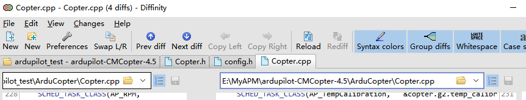

`skybrush` 的`4.5` 的代码和 `ArduPilot-4.5` 的代码对比。 


## 1、在 Copter 中新加 Mode

> `mode.h` 中定义 `DRONE_SHOW`

添加到枚举类中

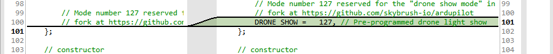


设置 `ModeDroneShow` 为 `ModeGuided` 、`ModeLoiter`、`ModeRTL`的友元。

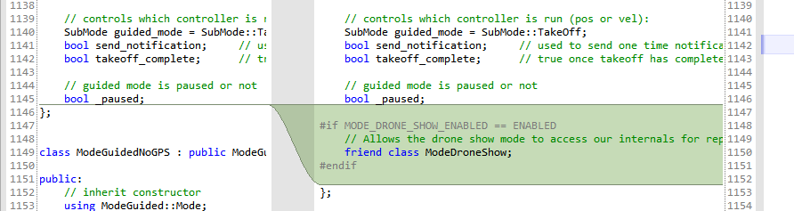

设置为友元应该是后续会用到这些模式，`Guided` 应该就是用来飞航点的， `Loiter` 在到达航点之后用于定点，后面的 `RTL` 应该是用于最后降落的。

---

从这个函数我们可以发现，在 `Copter` 中所有的模式定义都是在 `mode.h` 中定义的，在外部只有其他 `mode` 实现的 `.cpp` 函数，没有 `.h` 的定义文件。

但是 `skybrush` 选择将模式的头文件定义一个新的文件中，最后将头文件引入到 `mode.h` 的最后。

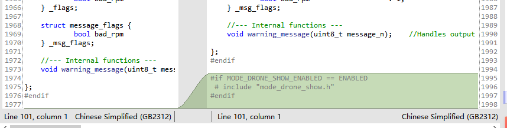

> `ArduCopter/mode.cpp`

这个文件中只有一行需要加的，这是函数的头

```c++
Mode *Copter::mode_from_mode_num(const Mode::Number mode)
```

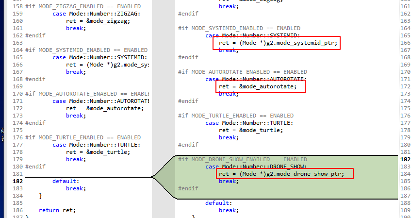

可以发现这个函数定义在 `Copter.h` 中，但是实现却是在 `mode.cpp`中，这个后面可以研究一下。


> 创建 `ArduCopter/mode_drone_show.h`

创建 `AC_DroneShowManager`  子类，`AC_DroneShowManager` 中的虚函数需要用到 `copter` 来实现，所以才创建为虚函数。在上层创建这个函数的子类，即可以用函数内部的方法，又可以调用同层的函数。

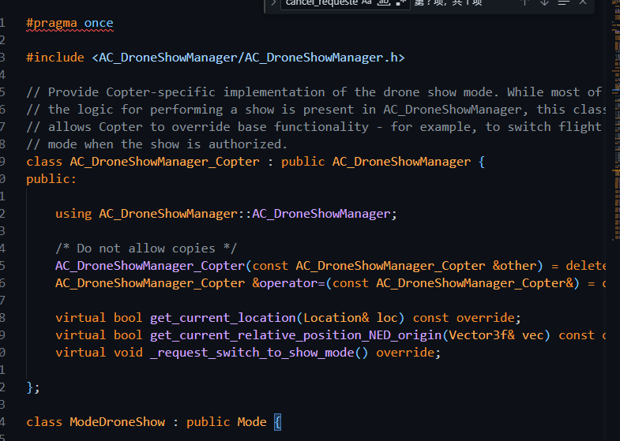


> `ArduCopter/config.h`

首先要添加宏，并启用

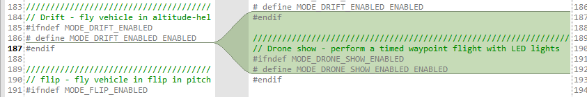

这个宏暂时不知道是干嘛的，应该是和 `CRTL` 集体返航有关的。

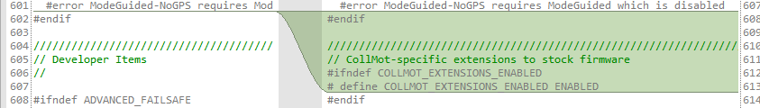

 

> `ArduCopter/Parameters.h`

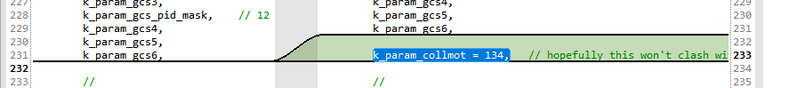


`AC_DroneShowManager_Copter` 会在 `mode_drone_show.h` 中定义。

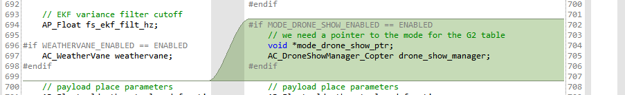

---

关于 `Parmaters.h` 与 `AP_Parma`

```
//TO-DO
```


> `ArduCopter/Copter.h`

在 `Copter.h` 的定义中，要把 `drone_show` 相关的类加入到整个系统中。

首先引入头文件

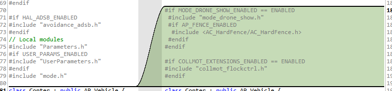

在 `class copter` 中设置友元，`AC_DroneShowManager_Copter` 是 `AC_DroneShowManager` 的子类，在  `mode_drone_show.h` 中定义。

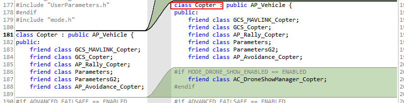

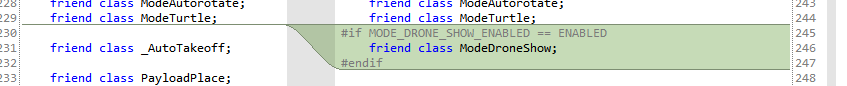

除了友元，还要在 `private: `中再定义一个。

关于友元: [C++：友元（看这一篇就够了）_c++ 友元-CSDN博客](https://blog.csdn.net/weixin_46098577/article/details/116596183)。在这里就是可以让 `Copter` 访问 `ModeDroneShow` 的私有变量。

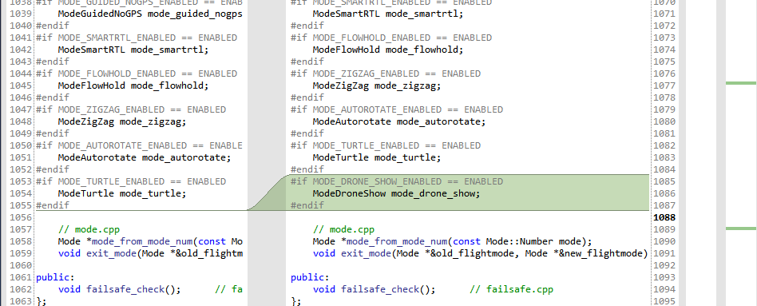

---

还有 `CollMotFlockCtrl` 需要在 `private` 中定义

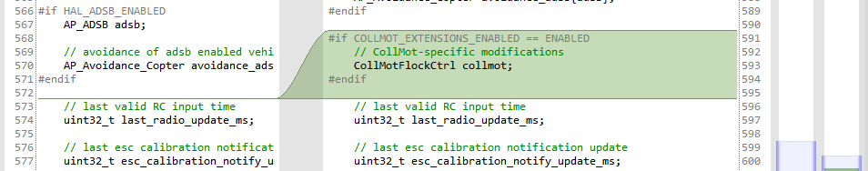

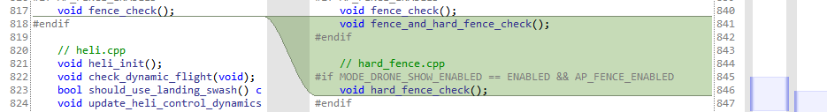


整个 `Copter.h` 中就只多了这些内容，`mode_drone_show` 是我们的核心， `extenstions` 目前看来是一个加强版的地理围栏。


> `ArduCopter/Copter.cpp`

在任务调度表中加入 `AC_DroneShowManager`

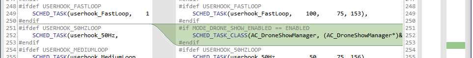

这里是要调用 `AC_DroneShowManager` 中的 `update` 函数


---

这里研究一下 `Ardupilot ` 的任务调度系统

`SCHED_TASK`: (具体要运行的函数名称，频率，预期运行的时间，优先级) 执行具体的方法

`SHEED_TASK_CLASSS`：（类名，要执行的类指针，类中要执行的函数，频率，预期运行的时间，优先级）执行类方法


