使用 `Diffinity` 对比代码


`skybrush` 的`4.5` 的代码和 `ArduPilot-4.5` 的代码对比。 


## 0、遇到的问题

### 0.1、参数系统


### 0.2、Mavlink 消息有那些，`Data16`，`Data32` 是什么？

`skybrush` 没有在 `mavlink` 中新增消息，那么新的那些消息是如何发送出去的？


### 0.3、文件系统

 航点是存储在  `EEPROM` 里，还是 `SD` 卡里面？


### 0.4、Log系统


### 0.5、舞步文件如何上传？


### 0.6、在表演的过程中如何读取一个一个航点的


### 0.7、在表演过程中如果一个无人机的信号丢了，会采取什么行动


### 0.8、地面站每个无人机应当显示的信息

`ModeDroneShow mode;`

1. `mode._stage`
2. `mode._home_position_set`
3. `mode._preflight_calibration_done`

4. 每个飞机的 `mavlink` 消息都应该可以查询到，自动存储到地面站的数据库里。


## 1、在 Copter 中新加 Mode

> `mode.h` 中定义 `DRONE_SHOW`

添加到枚举类中


设置 `ModeDroneShow` 为 `ModeGuided` 、`ModeLoiter`、`ModeRTL`的友元。


设置为友元应该是后续会用到这些模式，`Guided` 应该就是用来飞航点的， `Loiter` 在到达航点之后用于定点，后面的 `RTL` 应该是用于最后降落的。

---

**关于友元：**

* 类可以允许其他 *类* 或者 *函数* 访问它的非公有成员，方法是令其他类或者函数成为它的友元。
* 友元不是类的成员也不受它所在区域访问控制级别的约束。
* 只能在类的命名空间中访问友元的私有成员，不能在 `main` 中调用其友元的私有成员。
* 友元关系不存在传递性。

---

从这个函数我们可以发现，在 `Copter` 中所有的模式定义都是在 `mode.h` 中定义的，在外部只有其他 `mode` 实现的 `.cpp` 函数，没有 `.h` 的定义文件。

但是 `skybrush` 选择将模式的头文件定义一个新的文件中，最后将头文件引入到 `mode.h` 的最后。


> `ArduCopter/mode.cpp`

这个文件中只有一行需要加的，这是函数的头

```c++
Mode *Copter::mode_from_mode_num(const Mode::Number mode)
```


可以发现这个函数定义在 `Copter.h` 中，但是实现却是在 `mode.cpp`中，这个后面可以研究一下。

还有一点就是，有的返回的是 `g2.` 全局参数中的指针，有的是返回的 `mode.h` 中定义的指针。这个现在也不知道有什么区别


> 创建 `ArduCopter/mode_drone_show.h`

创建 `AC_DroneShowManager`  子类，`AC_DroneShowManager` 中的虚函数需要用到 `copter` 来实现，所以才创建为虚函数。在上层创建这个函数的子类，即可以用函数内部的方法，又可以调用同层的函数。


> `ArduCopter/config.h`

首先要添加宏，并启用


这个宏暂时不知道是干嘛的，应该是和 `CRTL` 集体返航有关的。


 

> `ArduCopter/Parameters.h`


`AC_DroneShowManager_Copter` 会在 `mode_drone_show.h` 中定义。之前 `mode.cpp` 中就使用了这个指针。


---

关于 `Parmaters.h` 与 `AP_Parma`

```
//TO-DO
```

> `ArduCopter/Parameters.cpp`

在最后加入 `DroneShow` 的参数`127`

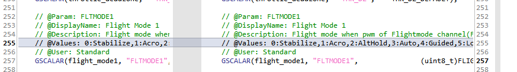

这里的 `GSCALAR()` 目前还不知道是什么和 `AP_GROUPINFO()` 可能是类似的。


是不是只有当这里是 `AP_SUBGROUPINFO` 定义了之后，我在 `libraries/AP_DroneShow` 里定义的  `AP_GROUPINFO` 才有意义？

在实际使用的时候应该是 `SHOW_...` 才是一个完整的参数。

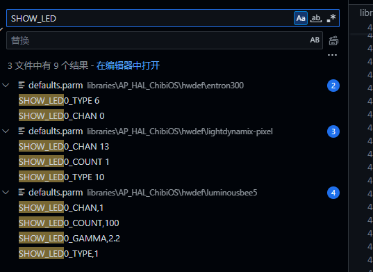

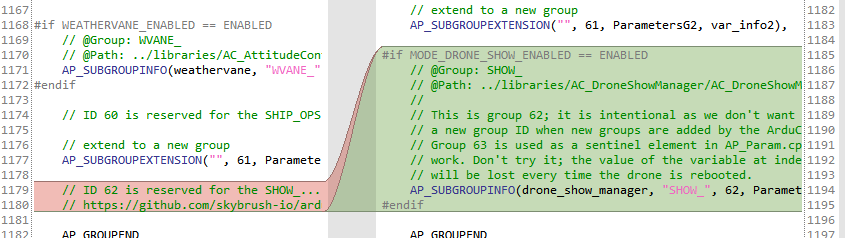


从这里可以看出 `g2.` 的`mode_drone_show_ptr` 还是来自于 `copter.mode_drone_show` 所以在 `mode.cpp`中为什么要用 `g2.mode_drone_show_ptr` 不直接用 `copter.mode_drone_show` 呢？我感觉应该是一样的。

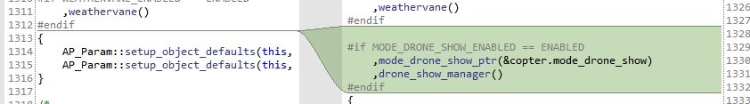


> `ArduCopter/Copter.h`

在 `Copter.h` 的定义中，要把 `drone_show` 相关的类加入到整个系统中。

首先引入头文件


在 `class copter` 中设置友元，`AC_DroneShowManager_Copter` 是 `AC_DroneShowManager` 的子类，在  `mode_drone_show.h` 中定义。


除了友元，还要在 `private: `中再定义一个。

关于友元: [C++：友元（看这一篇就够了）_c++ 友元-CSDN博客](https://blog.csdn.net/weixin_46098577/article/details/116596183)。在这里就是可以让 `Copter` 访问 `ModeDroneShow` 的私有变量。


---

还有 `CollMotFlockCtrl` 需要在 `private` 中定义


整个 `Copter.h` 中就只多了这些内容，`mode_drone_show` 是我们的核心， `extenstions` 目前看来是一个加强版的地理围栏。


> `ArduCopter/Copter.cpp`

在任务调度表中加入 `AC_DroneShowManager`


这里是要调用 `AC_DroneShowManager` 中的 `update` 函数


---

这里研究一下 `Ardupilot ` 的任务调度系统

`SCHED_TASK`: (具体要运行的函数名称，频率，预期运行的时间，优先级) 执行具体的方法

`SHEED_TASK_CLASSS`：（类名，要执行的类指针，类中要执行的函数，频率，预期运行的时间，优先级）执行类方法

---

在 `void Copter::ten_hz_logging_loop()` 中把表演的 `log` 加上

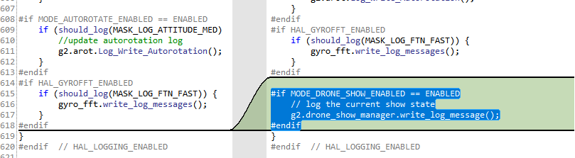

> `ArduCopter/system.cpp`

在系统初始化中加入 `drone_show_manager` 的早期初始化

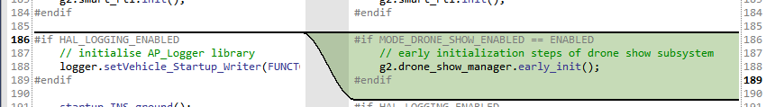

等全部初始化之后，在判断是否要直接开机就切换到 `mode_drone_show`。

`(enum Mode::Number)` 为 *强类型枚举* ，`enum class` 需要显式转换才能与整数类型交互，所以 `g.intial_mode.get()` 前面要加强转。

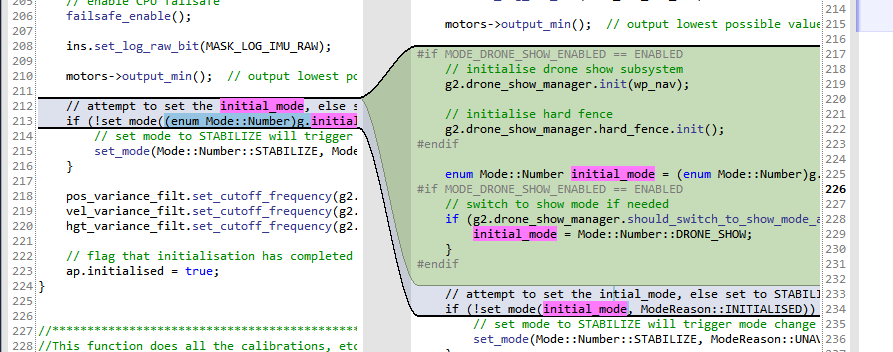

> `ArduCopter/GCS_Mavlink` `.h/.cpp` 

在 `.h` 中在最后加一个虚函数

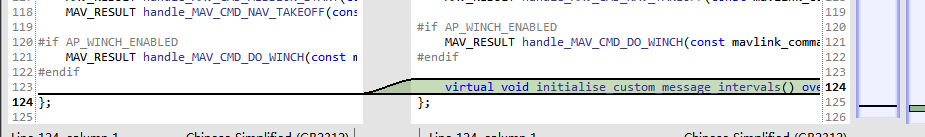

在 `.cpp` 中加入 `DRONE_SHOW` 

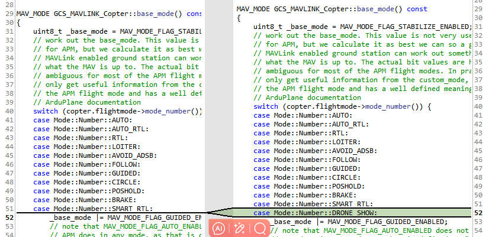

在 `try_send_message` 加入 `MSG_DRONE_SHOW_STATUS` ，这个 `enum` 定义在 `libraries/GCS_MAVLink/ap_message.h`


但是我有个疑问这里面只定义几十个 `msg` 但是 `mavlink` 的消息有那么多，这个单独定义的  `ap_message` 是干嘛的。

这个文件通常只包含 `ArduPilot` 系统内自定义的消息标识和部分常用 `MAVLink` 消息的封装或枚举。

---

` GCS_MAVLINK_Copter::handle_command_int_packet` 

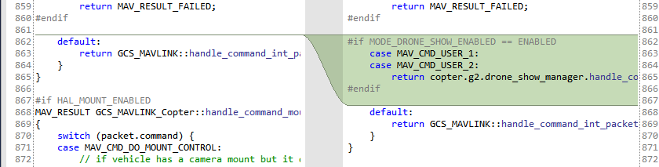

可以看出这两个命令是用了 `ardupilotmega.xml` 中的用户自定义 `CMD`。

`MAV_CMD_USER_1`  用于清除或重新加载舞步文件。

* `param1 = 0`，重新加载舞步文件。
* `param1 = 1` ，清除舞步文件。

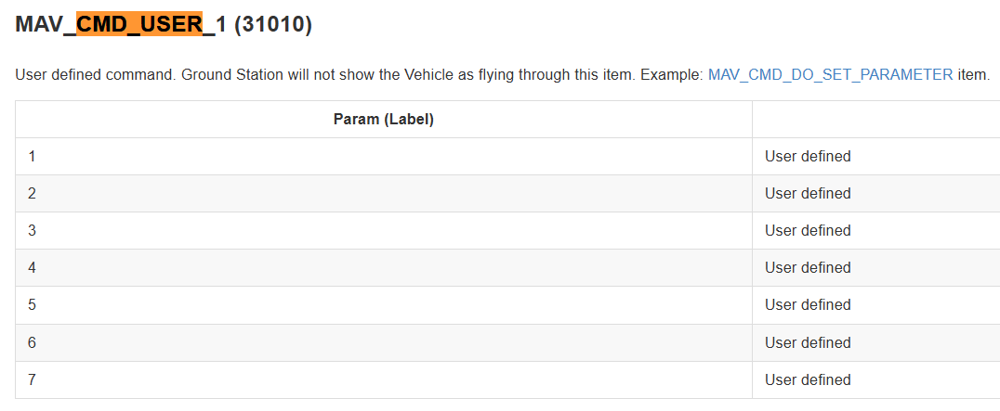

`MAV_CMD_USER_2`  该命令用于设置无人机编队表演的原点、方位和海拔高度（AMSL），并在 `COMMAND_INT` 格式下接收命令以保持坐标精度。

* `param1`  command code ，只能为 0
* `param4`: orientation
* `param5(x)`: lat
* `param6(y)`: lng
* `param(z)`: AMSL

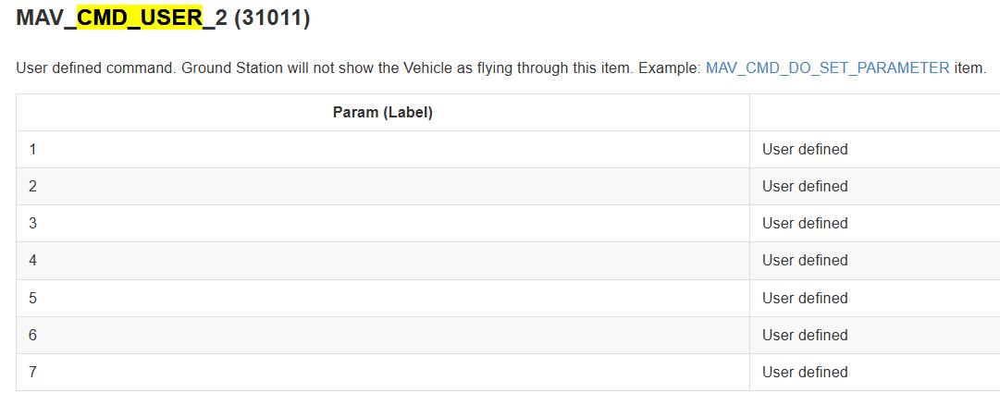


---

`GCS_MAVLINK_Copter::handle_message` : 用于处理从地面控制站 (GCS) 传来的 MAVLink 消息。函数通过消息的 `msgid` 来识别消息类型，并在适用的情况下调用相应的处理函数。

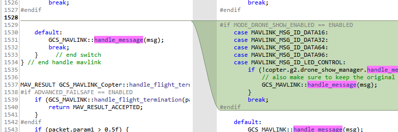

这几个 `Mavlink` 消息都是 `ardupilotmage` 里面的， `data16`  就是 `uint8_t data[16]` 。因为有 `len` 存在，后面的 `0` 都是不会发送的，其实这几个类型除了最大可发送的数据，并没有什么区别。


这几个消息的类型都是一样的，都是由 `type`，`len`，`data` 三部分组成。

```cpp
typedef struct __mavlink_data64_t {
 uint8_t type; /*<  Data type.*/
 uint8_t len; /*< [bytes] Data length.*/
 uint8_t data[64]; /*<  Raw data.*/
} mavlink_data64_t;
```

奇怪的是在这 4 个 `msg` 都指向同一个 `_handle_custom_data_message()`

这个函数只有两个功能：

* 设置表演开始时间 `START_CONFIG`
* 安排集体返航 `CRTL_TRIGGER`

那为什么要 4 个 `msg` 呢？


`_handle_led_control_message` 是单独的一个 `msg` 直接使用的 `ardupilotmega`  中的消息。可以设置全部的无人机，也可只让指定的无人机亮灯。


---

`GCS_MAVLINK_Copter::capabilities()` : 用于定义无人机支持的 MAVLink 协议功能。具体而言，这些功能通过一系列标志位来表示，并且返回值包含所有支持的功能标志。


如果启用了无人机编队模式 (`MODE_DRONE_SHOW_ENABLED`)，则添加一个自定义扩展标志 `0x4000000`，用于指示无人机支持特定于编队的扩展功能。

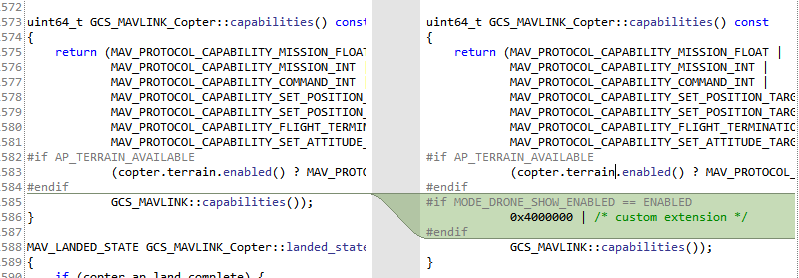


---

`initialise_custom_message_intervals` ： 函数用于初始化自定义的 MAVLink 消息发送间隔。该函数主要在启用编队模式 (`MODE_DRONE_SHOW_ENABLED`) 时自动设置某些消息的发送频率，以减轻地面站的设置负担。

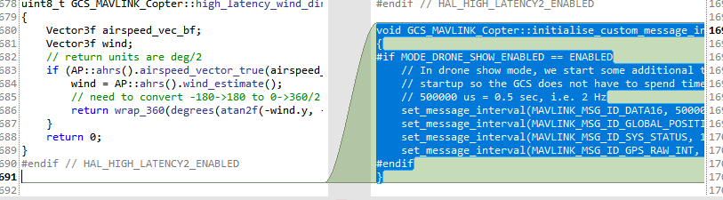


> `ArduCopter/events.cpp`

`Copter::should_disarm_on_failsafe()` : 用于判断在失效保护（failsafe）情况下是否应自动解锁电机的函数。

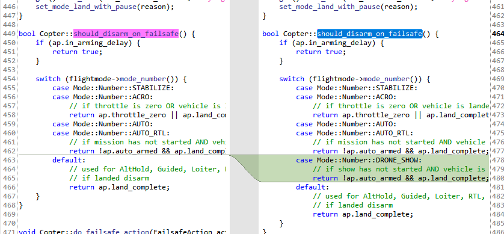

整个 `events.cpp` 都是 `Copter.h` 中部分函数的实现，所以本质上是 `Copter.cpp` 的一部分，这样拆分了 `Copter.cpp` 减少其中的代码量，同时增加了可读性。

## 2、libraries/GCS_MAVLink

* `ap_message.h` 

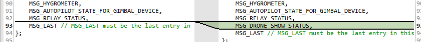

* ``


