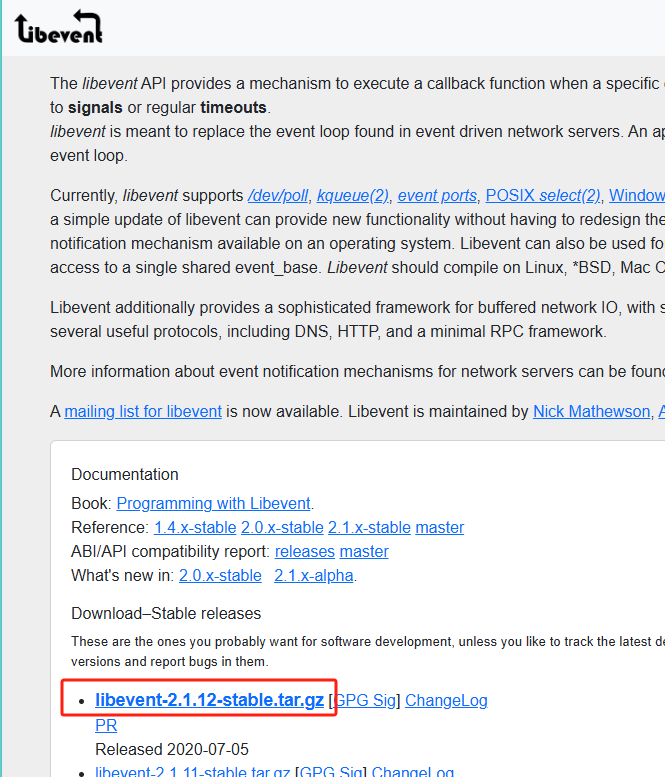
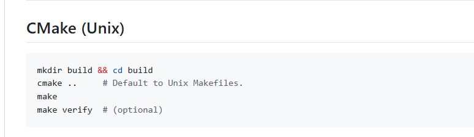
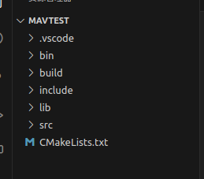

## 在 `Ubuntu` 环境下使用 `cmake` 构建 `libevent`

### 1、下载 libevent 直接在官网下载

官网：[libevent](https://libevent.org/)

github: https://github.com/libevent/libevent



解压后看 `libevent` 的 `github` ，`libevent` 也是通过 `cmake` 构建的



这会生成 `.a` 的静态库直接链接这个静态库就好了


### 2、cmake 构建 MavTest 项目



这是项目的整体结构

```
MavTest
├── bin
│   └── mavTest
├── build
│   ├── CMakeCache.txt
│   ├── CMakeFiles
│   ├── cmake_install.cmake
│   ├── compile_commands.json
│   ├── lib
│   ├── Makefile
│   └── src
├── CMakeLists.txt
├── include
├── lib
│   ├── CMakeLists.txt
│   └── libevent
└── src
    ├── CMakeLists.txt
    └── main.cpp
```

`MavTest/CMakeLists.txt`

```cmake
cmake_minimum_required(VERSION 3.16)

project(MavTest VERSION 0.1 LANGUAGES C CXX)

set(CMAKE_CXX_STANDARD 17)
set(CMAKE_CXX_STANDARD_REQUIRED ON)

# 设定可执行二进制文件的目录（最后生成的可执行文件放置的目录）
SET(EXECUTABLE_OUTPUT_PATH ${PROJECT_SOURCE_DIR}/bin)

 # 设定头文件目录
include_directories(${PROJECT_SOURCE_DIR}/include)
 
# 增加子文件夹，进入源代码文件夹继续构建
add_subdirectory(${PROJECT_SOURCE_DIR}/src)
add_subdirectory(${PROJECT_SOURCE_DIR}/lib)


```

`MavTest/src/CMakeLists.txt`

```cmake
add_executable(mavTest
    main.cpp
)

target_link_libraries(mavTest PRIVATE event)
```

`MavTest/lib/CMakeLists.txt`

这个文件是最重要的

> 注意： 在 `libevent`中已经提前 build 过了，所以链接的是 `libevent` 中的 `.a` 静态库
>
> 同时把 `/lib/libevent/include`也加入进来，方便跳转
>
> 如果没有 build 就要使用 `add_library` ，把加入的头文件编译成 `.a` 静态库，这是由 `cmake` 完成的，这个库很大，编译他需要点时间，所以我们直接链接编译好之后的静态库就更方便。
>
> [cmake：add_library生成静态库和动态库_cmake stdcall library-CSDN博客](https://blog.csdn.net/zhizhengguan/article/details/111713847)

```Cmake	
 # add libevent
set(LIBEVENT_LIB ${CMAKE_SOURCE_DIR}/lib/libevent/build/lib)
set(LIBEVENT_INCLUDE ${CMAKE_SOURCE_DIR}/lib/libevent/build/include)

include_directories(${CMAKE_SOURCE_DIR}/lib/libevent/include)
# 链接静态库
link_directories(LIBEVENT_INCLUDE)
link_libraries(LIBEVENT_LIB)

set(LIBEVENT_LIB event)
```


