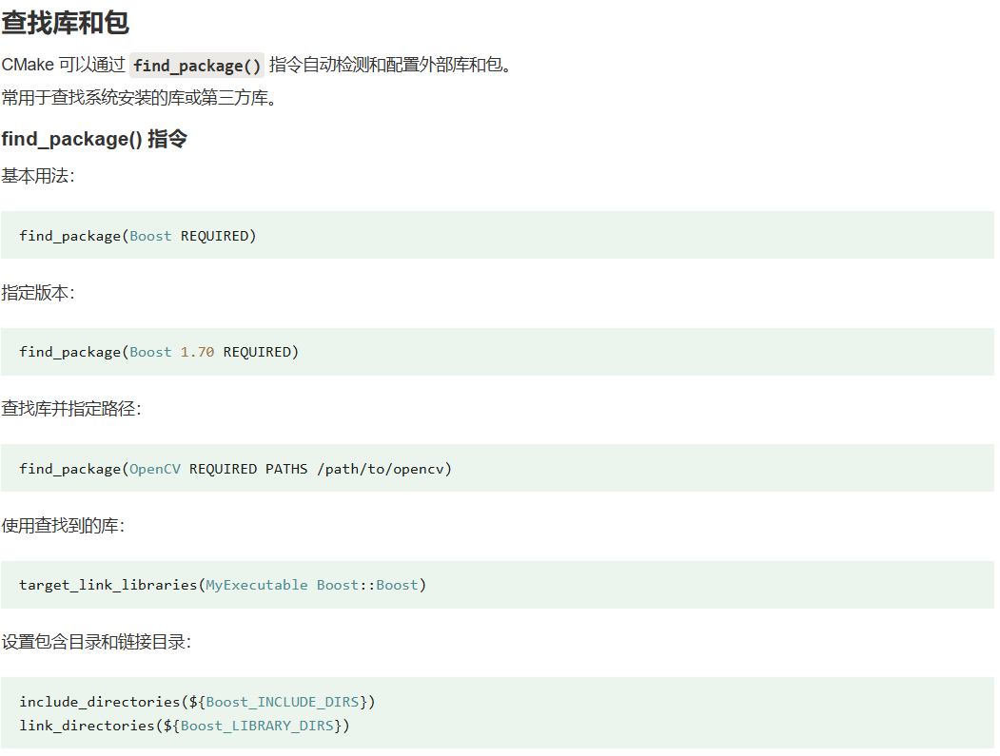

## 1、CMake 

CMakeLists.txt（不能多不能少，大小写也不能错） 是 CMake 的配置文件，用于定义项目的构建规则、依赖关系、编译选项等。

每个 CMake 项目通常都有一个或多个 CMakeLists.txt 文件。


### 1.1、CMake 预定义变量

* `CMAKE_SOURCE_DIR`：
* `PROJECT_NAME`

### 1.2、CMake 函数

> `CMake` **函数不区分**大小写，但是 CMake 的**变量区分大小写**的。

*  指定 cmake 最低版本要求

    ```cmake
    cmake_minimum_required(VERSION <version>)
    #=============================================
    cmake_minimum_required(VERSION 3.22.1)
    ```

* 项目信息

    ```cmake
    project(<PROJECT-NAME>
            [VERSION <major>[.<minor>[.<patch>[.<tweak>]]]]
            [DESCRIPTION <project-description-string>]
            [HOMEPAGE_URL <url-string>]
            [LANGUAGES <language-name>...])
    #=========================================================
    project(QGroundControl
        VERSION ${QGC_APP_VERSION}
        DESCRIPTION ${QGC_APP_DESCRIPTION}
        HOMEPAGE_URL "https://qgroundcontrol.com/"
        LANGUAGES C CXX
    )
    ```

* 指定要生成的可执行文件和其源文件

    ```cmake
    add_executable(<target> <source_files>...)
    #==================================================
    qt_add_executable(${PROJECT_NAME}
        src/main.cc
        ${QGC_RESOURCES}
    )
    ```

* 创建一个库（静态库或动态库）及其源文件（放入的是当前项目的文件）

    ```cmake
    add_library(<target> <source_files>...)
    #===========================================
    qt_add_library(QGC STATIC
        CmdLineOptParser.cc
        CmdLineOptParser.h
        QGCApplication.cc
        QGCApplication.h
        QGCConfig.h
        QGCToolbox.cc
        QGCToolbox.h
    )
    ```

* 链接目标文件与其他库

    ```cmake
    target_link_libraries(<target> <libraries>...)
    #===================================================
    target_link_libraries(QGC
        PRIVATE
            Qt6::Quick
            Qt6::QuickControls2
            Qt6::QuickWidgets
            Qt6::Core5Compat
            Qt6::Bluetooth
            API
            ADSB
            AirLink
            AnalyzeView
            Audio
            AutoPilotPlugins
            Camera
            #...
            # UI
            Utilities
            UTMSP
            Vehicle
            VehicleSetup
            Viewer3D
            VideoManager
            VideoReceiver
        PUBLIC
            Qt6::Core
            Qt6::CorePrivate
            Qt6::Widgets
    )
    ```

* 查询包和库。常用于查找系统安装的库或第三方库

    ```cmake
    find_package(<PackageName> [<version>] [REQUIRED] [COMPONENTS <components>...])
    #============================================================
    find_package(Qt6
        REQUIRED
        COMPONENTS
            Bluetooth
            Charts
            Concurrent
            Core
            Core5Compat
            Location
            Multimedia
            Network
            Positioning
            Quick
            QuickControls2
            QuickWidgets
            OpenGL
            Sensors
            Sql
            Svg
            Test
            TextToSpeech
            Widgets
            Xml
        OPTIONAL_COMPONENTS
            LinguistTools
            SerialPort
        HINTS
            ${QT_LIBRARY_HINTS}
    )
    ```

    

* 定义变量

    ```cmake
    set(MY_VAR "Hello World")
    ```


#### 1.2.1、FetchContent

FetchContent，用于帮助我们管理外部依赖库。在 QGC 中通过这种方式引入  `mavlink` 库，且一直处于同步更新的状态。

```cmake
# src/MAVLink/CMakeLists.txt
############# MAVLink

include(FetchContent)
FetchContent_Declare(mavlink
        GIT_REPOSITORY https://github.com/mavlink/c_library_v2.git
        GIT_TAG 052b8579f8aeb941f34cc9896af22cf1f38939b9
)
FetchContent_MakeAvailable(mavlink)

target_include_directories(MAVLink
    PUBLIC
        ${mavlink_SOURCE_DIR}
        ${mavlink_SOURCE_DIR}/all
        ${mavlink_SOURCE_DIR}/common
)
```

直接在 `CMakeLists.txt` 中复制这一段就可以了。

## 2、CMake 项目架构实例（参考 QGC）


### 2.1、src/Comms


### 2.2、src/MAVLink


