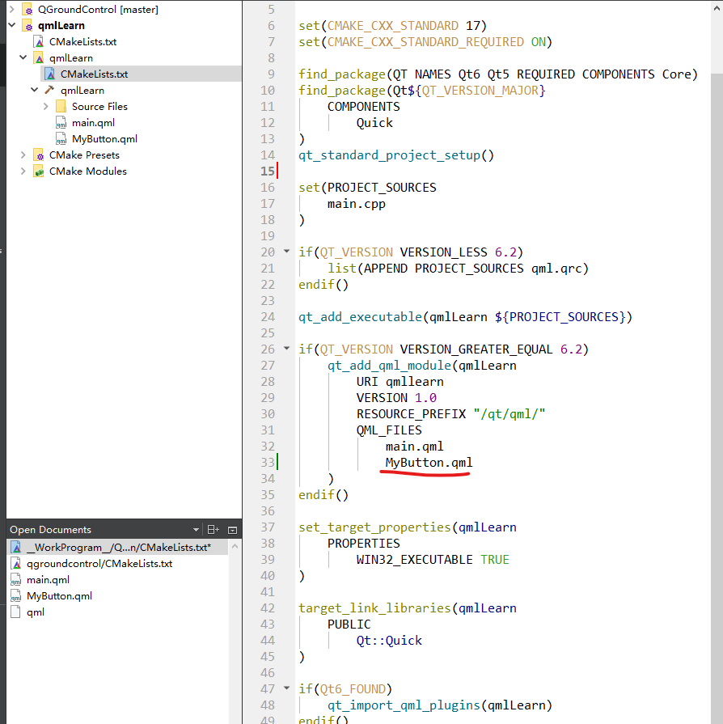
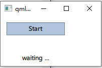

## 1、Property System

> 参考：
>
> * [Qt中Q_PROPERTY的作用，以及必要性和使用场景_qt property-CSDN博客](https://blog.csdn.net/m0_74091159/article/details/139039490)
>
> * [Qt 中的属性系统（Property System） - 知乎 (zhihu.com)](https://zhuanlan.zhihu.com/p/43348546)
> * [The Property System | Qt Core 6.8.0](https://doc.qt.io/qt-6/properties.html)

`Qt` 提供的这个属性系统，作用就是把类的信息暴露出来成为通用的大家都认识的信息。比如用 `C++` 语言写的`People` 类中有个 ~ 变量，但是如果用 `QML` 语言去读取就会出问题，因为 `QML` 有自己的规则，它不认识 `C++` 啊。怎么办呢？用 Qt 的属性系统就可以解决这个问题。属性系统可以这样理解：把一个类的成员变量或者成员函数用属性系统处理一下，它们就从 `C++` 内部中暴露出来，使得大家都认得。


```
Q_PROPERTY(type name
           READ getFunction
           [WRITE setFunction]
           [RESET resetFunction]
           [NOTIFY notifySignal]
           [REVISION int]
           [DESIGNABLE bool]
           [SCRIPTABLE bool]
           [STORED bool]
           [USER bool]
           [CONSTANT]
           [FINAL])
```

参数说明

* type：属性的数据类型。
* name：属性的名称。
* READ getFunction：用于读取属性值的**成员函数**。
* WRITE setFunction：用于写入属性值的成员函数（可选）。
* RESET resetFunction：用于重置属性值的成员函数（可选）。
* NOTIFY notifySignal：属性值改变时发出的**信号**（可选）。
* REVISION int：属性的版本号（可选）。
* DESIGNABLE bool：属性是否在Qt设计器中可见（可选）。
* SCRIPTABLE bool：属性是否可以在Qt脚本中使用（可选）。
* STORED bool：属性是否应该被存储（可选）。
* USER bool：是否是用户属性（可选）。
* CONSTANT：属性值是否恒定不变（可选）。
* FINAL：属性是否是最终属性，不能被子类重写（可选）。

```c++
Q_PROPERTY(bool focus READ hasFocus)
Q_PROPERTY(bool enabled READ isEnabled WRITE setEnabled)
Q_PROPERTY(QCursor cursor READ cursor WRITE setCursor RESET unsetCursor)
```

第一个定义了一个 `bool focus` ，要读取这个属性要用当前 `class` 中的 `hasFocus` 函数。后面的几个大写的就是说后面这个跟着这个函数是什么功能。 `READ isEnabled` ，要读这个属性就要用到 `isEnabled` 这个函数，以此类推。

```c++
Class Widget : public QObject
{
    Q_PROPERTY(bool focus WRITE setFocus)
    Q_OBJECT
public:
    bool hasFocus() const;
    void setFocus(bool on);
}
```


`focus` 这个属性其实和这个 `C++`  类的关系不是从属关系，这个类只是操作这个属性，并不是 `Widget` 的成员变量。如何注册一个成员变量为属性呢？这就要用到 `MEMBER` ，`focus MEMBER m_focus` 讲外部可以调用的 `focus` 和内部的 `m_focus` 绑定在了一起。

虽然 `READ`、`WRITE`、`MEMBER` 这三个关键字都可以赋予属性值可读可写的特性，但是 `READ`、`WRITE` 和 `MEMBER` 不能同时使用，赋予可读可写特性一次就够了，不能赋予两次。就好像一个对象不能被析构两次一样。

如果我们希望某个属性值变化时能发射出信号，Qt 的属性系统是用 `NOTIFY` 关键字来指定信号。

```c++
Class Widget : public QObject
{
    Q_PROPERTY(bool focus MEMBER m_focus NOTIFY focusChanged)
    Q_OBJECT
public:
    bool hasFocus() const;
    void setFocus(bool on);
signals:
    void focusChanged();
private:
    bool m_focus;
} 
```


### 应用


## 2、Component

> 参考：

`Component` 是可重用、封装的 `QML` 类型，具有明确定义的接口。

组件通常由**组件文件**定义 - 即 `.qml` 文件，一个`.qml`文件就是一个组件。而 [Component](https://doc.qt.io/qt-6/qml-qtqml-component.html) 类型本质上允许在 `QML` 文档中内联定义 `QML` 组件，而不是作为单独的 `QML` 文件。


**Component 类型通常用于为视图提供图形组件**。例如，**ListView**::**delegate** 属性需要一个组件来指定每个列表项的显示方式。


### 2.1、基于文件方式的 Component

首先我们先编写组件文件。

> 最好用  `Item` 来作为顶层标签。
>
> If you want to, you could even go a step further and use an `Item` as a root element. This prevents users from changing the color of the button we designed, and provides us with more control over the exported API. The target should be to export a minimal API. Practically, this means we would need to replace the root `Rectangle` with an `Item` and make the rectangle a nested element in the root item.

```qml
// MyButton.qml
import QtQuick 2.3

Item{
    id: root
    // export button properties
    property alias text: label.text
    signal clicked

    Rectangle {
        id: rec
        width: 116; height: 26
        color: "lightsteelblue"
        border.color: "slategrey"
        
        Text {
            id: label
            anchors.centerIn: parent
            text: "Start"
        }

        MouseArea {
            anchors.fill: parent
            onClicked: {
                root.clicked()
            }
        }
    }
}
```

在 `CMakeLists.txt` 中把这个文件加入当前项目中。

> 这一步我在 `Visual Studio` 中一直无法通过编译，但是在  `Qt Creater` 中就可以编译。



在 `Main.qml` 中调用这个组件。

```qml
//Main.qml

import QtQuick 2.9
import QtQuick.Window 2.2

Window {

    visible: true
    width: 200
    height: 100
    title: "qmlLearn"

    MyButton {
        id: button
        x: 12; y: 12
        text: "Start"
        onClicked: {
            status.text = "Button clicked!"
        }
    }
   
    Text { // text changes when button was clicked
        id: status
        x: 12; y: 76
        width: 116; height: 26
        text: "waiting ..."
        horizontalAlignment: Text.AlignHCenter
    }

}
```




### 2.2、使用  Component 新建窗口

首先还是编写 `MyWindow.qml`  

```qml
// MyWindow.qml
import QtQuick 2.9
import QtQuick.Window 2.2

Item {

    id: root

    Window {
        id: window
        visible: true
        width: 200
        height: 100
        title: "MyWindows"
    }

}
```

同样还是要加入 `CMakeLists.txt` 方法和上文一样就不截图了。

主文件这里有点变化

```qml
// main.qml
import QtQuick 2.9
import QtQuick.Window 2.2

Window {
    id: root
    visible: true
    width: 200
    height: 100
    title: "qmlLearn"

    MyButton {
        id: myButton
        x: 12; y: 12
        text: "Start"
        onClicked: {
        	// 新建组件
            var comp_myWindow = Qt.createComponent("MyWindow.qml")
            // 这种方式新建窗口要有父类，父窗口关闭子窗口也会关闭
            var new_win = comp_myWindow.createObject(root);
            new_win.show()
        }
    }

    /*MyWindow {
        id: myWindow
    }*/

    Text { // text changes when button was clicked
        id: status
        x: 12; y: 76
        width: 116; height: 26
        text: "waiting ..."
        horizontalAlignment: Text.AlignHCenter
    }
}
```


写这个应用的目的是为了之后我们把每一个小的 `demo` 都写成一个 `Component`，每曾加一个 `demo` 我们就在主界面加一个按钮去激活它。 


## 3、统一位置显示不同的组件


## TO-DO、qrc 方式组织 qml 文件


## TO-DO、QML_ELEMENT

> 参考
>
> * [Exposing Attributes of C++ Types to QML | Qt Qml 6.8.0](https://doc.qt.io/qt-6/qtqml-cppintegration-exposecppattributes.html)
> * [QQmlEngine Class | Qt Qml 6.8.0](https://doc.qt.io/qt-6/qqmlengine.html#QML_ELEMENT)


TO-DO、修改指定的启动 qml 文件


