> 修改 `mavlink` `sysID` 到 `3 bytes`


需要修改的内容

1. `mavlink` 源代码
    * 消息的定义
    * 组帧，解帧的函数
2. `ardupilot` 的源代码
3. `QGC` 中的源代码


## 1、mavlink 源码修改

大部分地面站和自动驾驶仪所采用的`通用消息集`定义于 [common.xml](https://mavlink.io/zh/messages/common.html)中 。

>  `generator/C`

`sysid`

`system_id`


> `message_definitions`

`mavlink - cpp - ardupilotmega.xml` 编译出来的需要的文件夹

* ardupilotmega

* common
* csAirLink
* cubepilot
* icarous
* minimal
* standard
* uAvionix

> common.xml

`gcs_system_id`

`target_system`

`target` 5694

`destination_system`  7703

`id_or_mac`

`uas_id` 7793


> generator/

`generator` 除了从 `.xml`  中生成代码，还有一些自动编码，解码的代码是写死的（有一些参数的名称通过占位符变化），这些也是要改的

 

> 报错 common
>
> 这几个都是需要257 字节以上的 payload 
>
> 1. mavlink_test_file_transfer_protocol
> 2. mavlink_test_v2_extension
> 3. mavlink_test_logging_data
> 4. mavlink_test_logging_data_acked
> 5. mavlink_test_play_tune_v2
> 6. mavlink_test_open_drone_id_message_pack


> 报错 ardupilotmega
>

`sysid`  设置为 uint32_t 后， 某些 `payload` 里有 `target_system` 这个参数的值，就会突破 `payload` 的最大上限，所有 `len` 的值也要改。

综合考虑之后将 `sysid` 和 `len` 都改为了 `uint16_t` 将 `payload_max_len` 改为了  `262` 不在是之前的 `255`。

最后编译 `all.xml` ，全部测试通过。

---

在  `APM` 中修改了 `mavlink` 通过 `sitl` 编译的时候， `mavlink` 有些代码还是在报错:


我把这个函数打个断点，在之前 `MyMavTest` 里面结果发现，没有调用过这个函数，说明在测试的时候没有测试到这个函数。

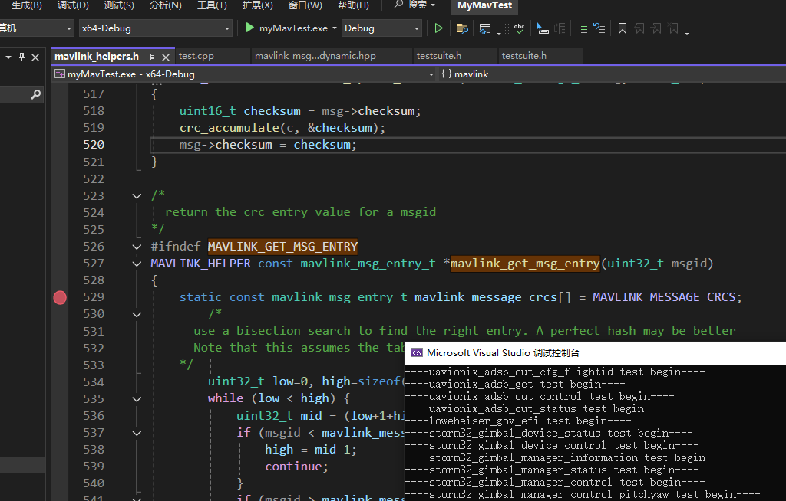

## 2、修改 APM 适配新的 mavlink 协议

从 `mavlink` 到 `apm/mavlink`  直接也有很大的区别， `apm` 对 `mavlink ` 做了很多删减，不能直接把之前我们修改的 `mavlink` 源代码直接复制过去，只能一步一步的改，就像第一次修改 `mavlink` 一样。


> common:

`target_system`

`id_or_mac`

`FILE_TRANSFER_PROTOCOL`


> 运行的脚本

```shell
# 特别注意，当你在将下面的一行命令复制到txt文件中时，一定不要在其下面再添加一个空行，
# 否则会被识别成两行命令，并且由于第二行是一个空行，没有实际的命令，从而运行时报错
/cygdrive/e/MyAPM/ardupilot/Tools/autotest/sim_vehicle.py -v ArduCopter -f coaxcopter
```


> 修改玩之后第一次报错
>
> `libraries/AP_Logger/LogFile.cpp - 279`

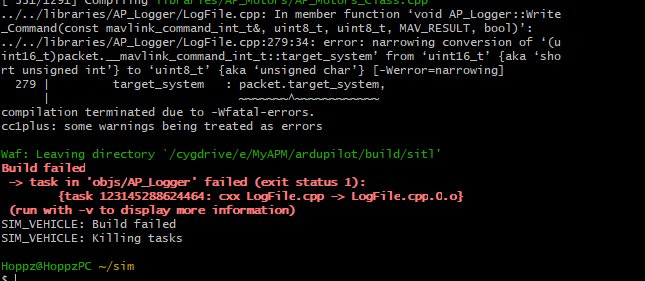

修改 `apm` 的定义 

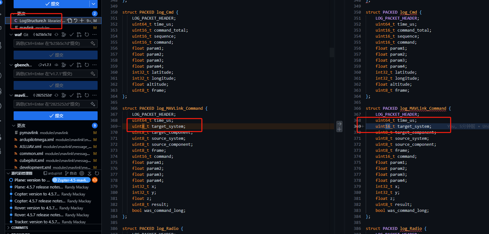


> 第二次报错

```shell
../../libraries/AP_OpenDroneID/AP_OpenDroneID.cpp: In member function ‘void AP_OpenDroneID::send_location_message()’:
../../libraries/AP_OpenDroneID/AP_OpenDroneID.cpp:488:9: error: designator order for field ‘__mavlink_open_drone_id_location_t::target_system’ does not match declaration order in ‘mavlink_open_drone_id_location_t’ {aka ‘__mavlink_open_drone_id_location_t’}
  488 |         };
      |         ^
compilation terminated due to -Wfatal-errors.

```

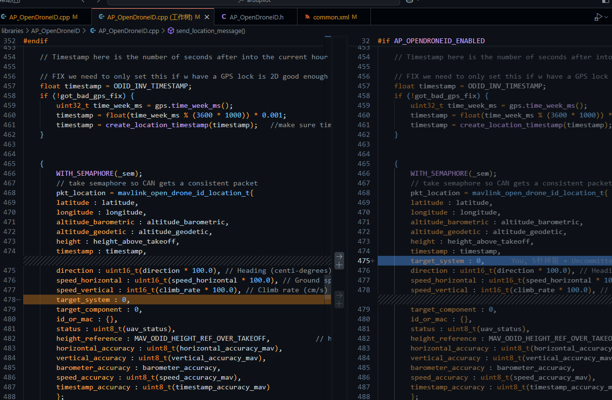


> 第三次报错

 

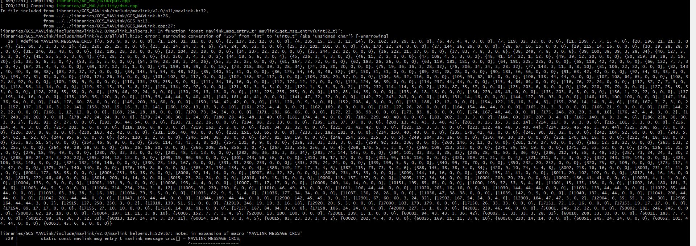

把 `uint8 -> uint16`

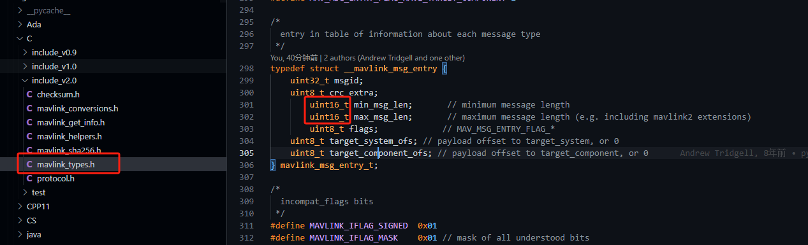


> 第四次报错

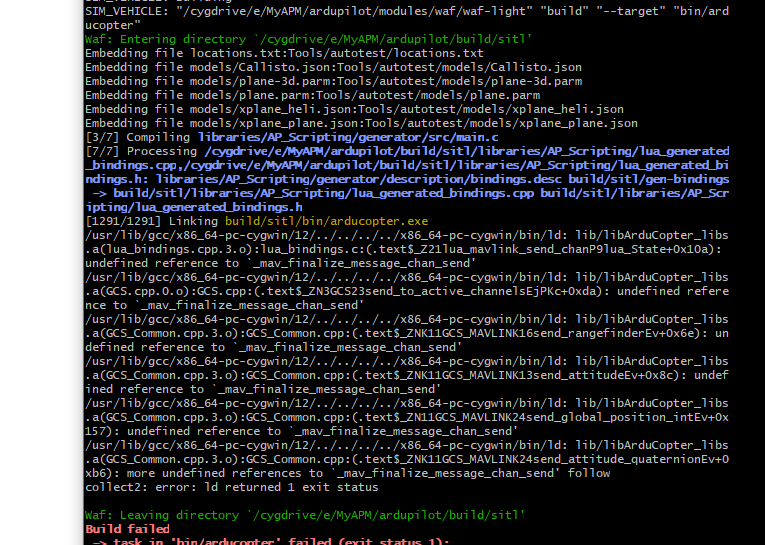

```shell
[3/7] Compiling libraries/AP_Scripting/generator/src/main.c
[7/7] Processing /cygdrive/e/MyAPM/ardupilot/build/sitl/libraries/AP_Scripting/lua_generated_bindings.cpp,/cygdrive/e/MyAPM/ardupilot/build/sitl/libraries/AP_Scripting/lua_generated_bindings.h: libraries/AP_Scripting/generator/description/bindings.desc build/sitl/gen-bindings -> build/sitl/libraries/AP_Scripting/lua_generated_bindings.cpp build/sitl/libraries/AP_Scripting/lua_generated_bindings.h
[1291/1291] Linking build/sitl/bin/arducopter.exe
/usr/lib/gcc/x86_64-pc-cygwin/12/../../../../x86_64-pc-cygwin/bin/ld: lib/libArduCopter_libs.a(lua_bindings.cpp.3.o):lua_bindings.c:(.text$_Z21lua_mavlink_send_chanP9lua_State+0x10a): undefined reference to `_mav_finalize_message_chan_send'
/usr/lib/gcc/x86_64-pc-cygwin/12/../../../../x86_64-pc-cygwin/bin/ld: lib/libArduCopter_libs.a(GCS.cpp.0.o):GCS.cpp:(.text$_ZN3GCS23send_to_active_channelsEjPKc+0xda): undefined reference to `_mav_finalize_message_chan_send'
/usr/lib/gcc/x86_64-pc-cygwin/12/../../../../x86_64-pc-cygwin/bin/ld: lib/libArduCopter_libs.a(GCS_Common.cpp.3.o):GCS_Common.cpp:(.text$_ZNK11GCS_MAVLINK16send_rangefinderEv+0x6e): undefined reference to `_mav_finalize_message_chan_send'
/usr/lib/gcc/x86_64-pc-cygwin/12/../../../../x86_64-pc-cygwin/bin/ld: lib/libArduCopter_libs.a(GCS_Common.cpp.3.o):GCS_Common.cpp:(.text$_ZNK11GCS_MAVLINK13send_attitudeEv+0x8c): undefined reference to `_mav_finalize_message_chan_send'
/usr/lib/gcc/x86_64-pc-cygwin/12/../../../../x86_64-pc-cygwin/bin/ld: lib/libArduCopter_libs.a(GCS_Common.cpp.3.o):GCS_Common.cpp:(.text$_ZN11GCS_MAVLINK24send_global_position_intEv+0x157): undefined reference to `_mav_finalize_message_chan_send'
/usr/lib/gcc/x86_64-pc-cygwin/12/../../../../x86_64-pc-cygwin/bin/ld: lib/libArduCopter_libs.a(GCS_Common.cpp.3.o):GCS_Common.cpp:(.text$_ZNK11GCS_MAVLINK24send_attitude_quaternionEv+0xb6): more undefined references to `_mav_finalize_message_chan_send' follow
collect2: error: ld returned 1 exit status

```

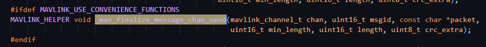


### 2.1、 修改 `libraries/GCS_MavLink`

这个文件夹中所有 `uint8_t ` 涉及到 `sysid` 的都改成了 `uint16_t` 。

这个文件夹改了之后肯定有很多其他的内部函数要出问题，直接编译然后一个一个模块修改


> 1.`libraries/AP_Camera/AP_Camera_MAVLinkCamV2.cpp:201:82: error:`

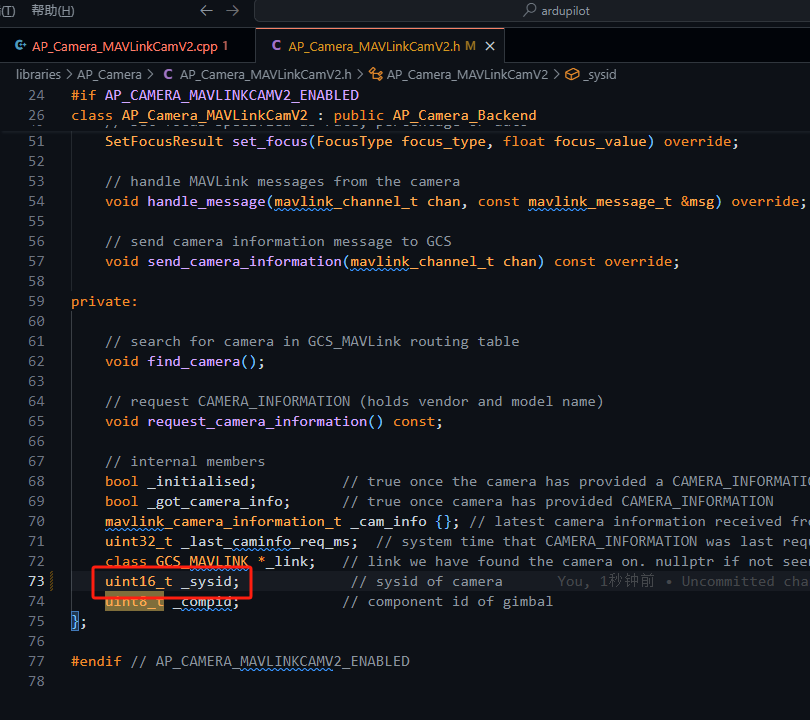

> 2.
>
> 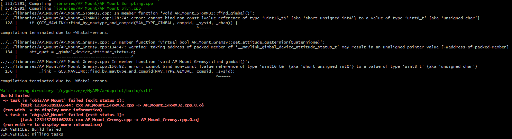


`/libraries/AP_Mount/AP_Mount_SToRM32.cpp:128:74: error:`

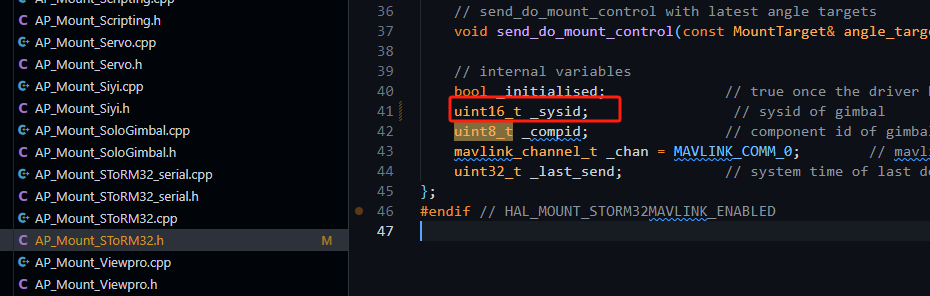

这后面我全局搜索了 `_sysid` 都改成了 `uint16_t`

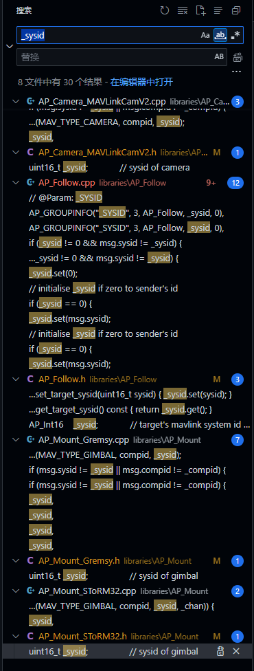

改了之后就直接再次编译。

> 3.
>
> `libraries/GCS_MAVLink/GCS_Dummy.h:29:13: error:`
>
> `/libraries/GCS_MAVLink/GCS_Common.cpp:5594:6:`

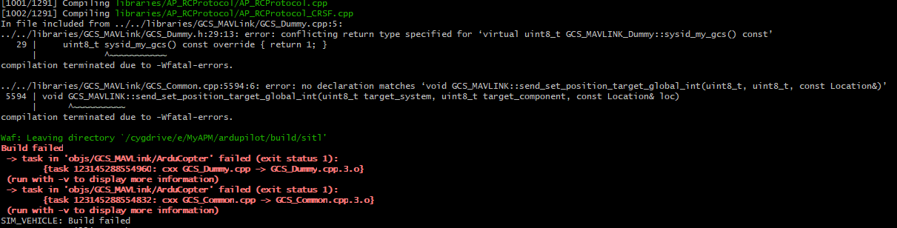

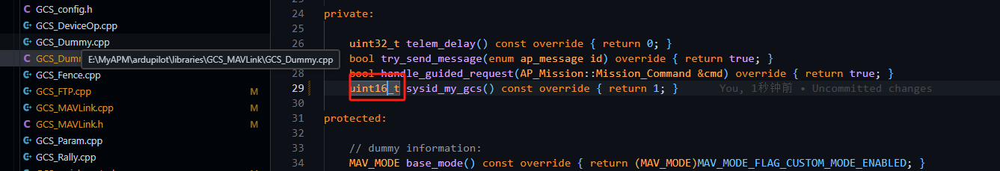

后面那个是 `target_system ` 没改，之后我又全局搜索 `target_system` 修改。基本上没要修改的地方。

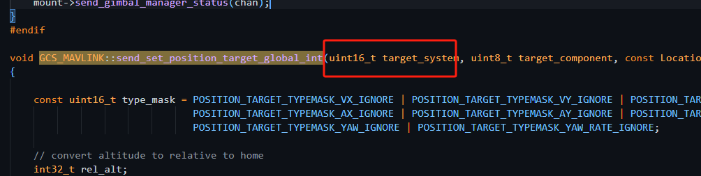


> 4.
>
> 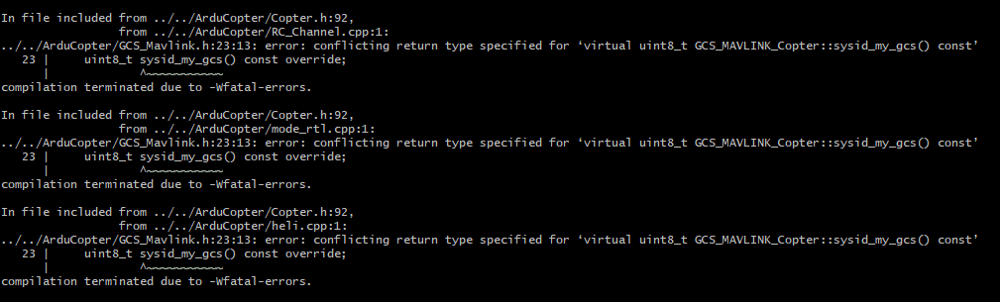

`ArduCopter/GCS_Mavlink.h:23:13`

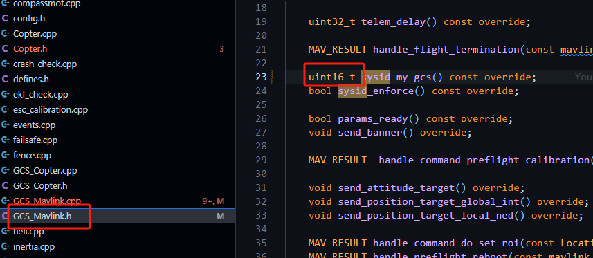

---

后面都是这样的策略解决的问题，就不记录了。

最后还是一样的结果。

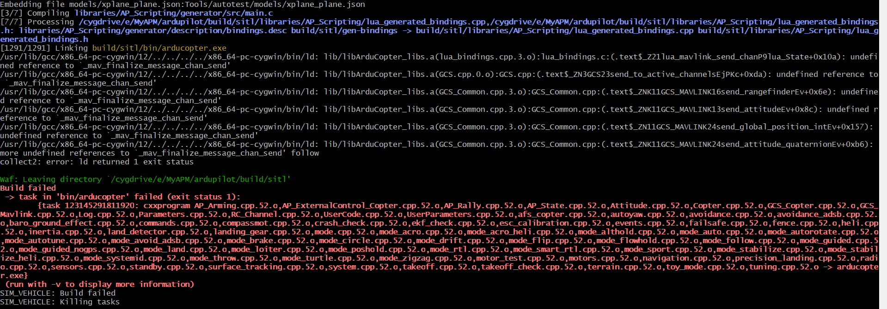


### 2.2、切换编译模式为 `./waf configure --board Pixhawk6x`

在这种编译进硬件的模式中任何的 `warning` 都会视为 `error` 。

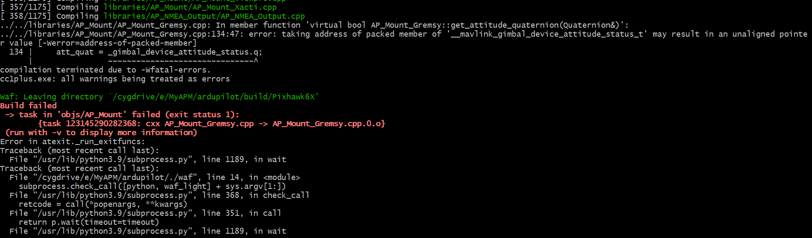

这个叫 `GPT` 改的，和数据定义时的打包有关。

```
// get attitude as a quaternion.  returns true on success
bool AP_Mount_Gremsy::get_attitude_quaternion(Quaternion& att_quat)
{
    att_quat = Quaternion(_gimbal_device_attitude_status.q[0], 
                      _gimbal_device_attitude_status.q[1], 
                      _gimbal_device_attitude_status.q[2], 
                      _gimbal_device_attitude_status.q[3]);
    return true;
}
```


这是最后的保存和 `sitl` 的类似。

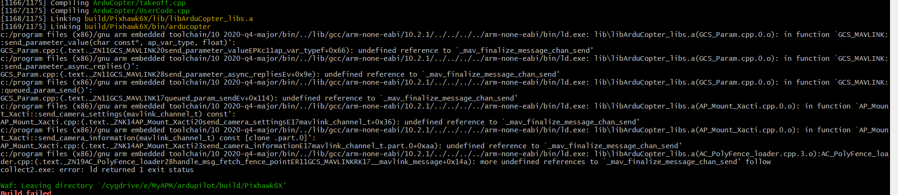

与这几个函数有关

* `GCS_MAVLINK::send_parameter_value`
* `GCS_MAVLINK::send_parameter_async_replies()`
* `GCS_MAVLINK::queued_param_send()`
* `AP_Mount_Xacti::send_camera_settings(mavlink_channel_t) const`
* ...

这些函数都是与 `_mav_finalize_message_chan_send` 这个函数有关系，但是我在这几个函数里面直接搜索都没搜到。

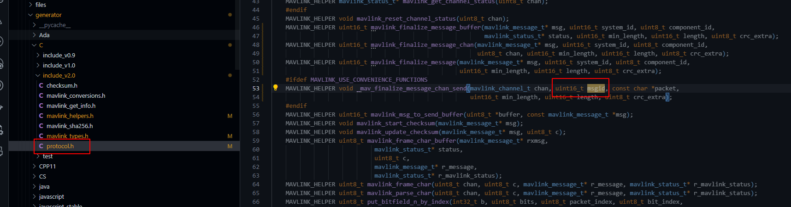

最后才发现是这里写错了。


