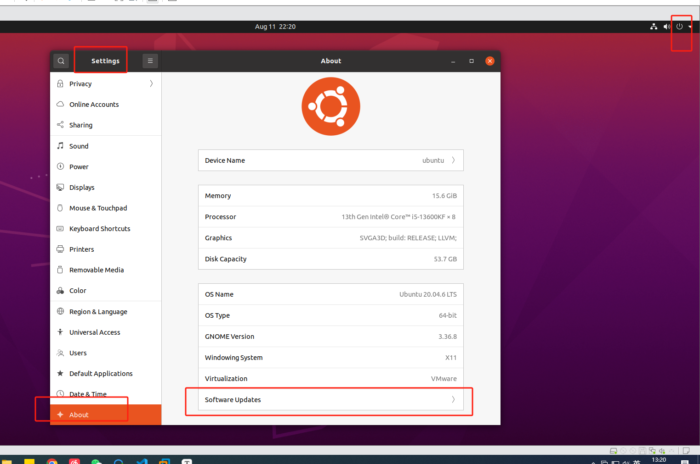

### 1、Ubuntu 设置 apt-get  的源



修改完后，重启

```shell
sudo apt-get update
```


### 2、需要安装的ruanj

```shell
sudo apt install git -y	

sudo apt install vim -y

sudo apt install net-tools -y
```


### 3、换 python 源

```shell
sudo apt install python3-pip -y

cd ~                   # 进入家目录 
mkdir .pip             # 新建.pip隐藏文件夹
# 或者 mkdir -p .config/pip      
cd .pip                # 进入.pip文件夹
# 或者 cd .config/pip               
touch pip.conf         # 新建pip.conf文件
vim pip.conf  

```


```
[global]
index-url = https://pypi.tuna.tsinghua.edu.cn/simple/
extra-index-url =
    https://mirrors.aliyun.com/pypi/simple/
    https://pypi.douban.com/simple/
    https://pypi.mirrors.ustc.edu.cn/simple/
    https://pypi.org/simple

[install]
trusted-host =
    pypi.tuna.tsinghua.edu.cn
    mirrors.aliyun.com
    pypi.douban.com
    pypi.mirrors.ustc.edu.cn
    pypi.org

```


### 4、 MobaX 连接 Ubuntu

[使用MobaXterm远程连接Linux服务器（Ubuntu）_mobaxerm怎么连接linux-CSDN博客](https://blog.csdn.net/m0_56147485/article/details/127201489)

```shell
sudo apt install openssh-server -y

sudo apt install openssh-client -y

sudo vi /etc/ssh/ssh_config
```

```shell
# add 
PasswordAuthentication yes
# :wq
```

```shell
sudo vi /etc/ssh/sshd_config

# add
PermitRootLogin yes
```


```shell
sudo /etc/init.d/ssh restart
```


### 5、samba Ubuntu 文件共享到 windows

[ubuntu 20.04 安装配置Samba服务，Windows 和 linux协同工作_ubuntu samba-CSDN博客](https://blog.csdn.net/mvp_Dawn/article/details/105847485)

```shell
sudo apt-get install samba samba-common -y

# 共享整个 home
sudo chmod 777 /home/ -R

# hoppz 必须是 ubuntu 的用户
sudo smbpasswd -a hoppz

# 备份
sudo cp /etc/samba/smb.conf /etc/samba/smb.conf.bak

# 修改
sudo vim /etc/samba/smb.conf
```


```shell
[home] 
    comment = home directories
    path = /home/ 
    public = yes  
    writable = yes 
    workgroup = DAWN 
```


```shell
# 重启服务
sudo service smbd restart
```


```
ifconfig
ip addr
```


### 6、分屏软件

```shell
sudo apt-get install terminator

```

